*Part 1 of 5*

|  | VIỆN ĐÀO TẠO QUỐC TẾ FPT DATA SCIENCE WITH AI-ML |  |
| --- | --- | --- |

# AI Job Market Salary Prediction
## Technical Specification Design - Semester II

| Lecturer: Ms. Nguyen Ha Vy | Lecturer: Ms. Nguyen Ha Vy |  |  |  |
| --- | --- | --- | --- | --- |
| Course: I1.2510.E0 | Course: I1.2510.E0 |  |  |  |
| Group: 03 | Group: 03 |  |  |  |
| Member: | Full Name | Full Name | Student ID |
|  | 1. | Huynh Minh |  |
|  | 2. | Ta Gia Hien |  |
|  | 3. | Gia Bao |  |
|  | 4. | Nguyen Kim Ngan | FIS00016 |
| - September 2026 - |  |  |  |

**TABLE OF CONTENTS**

# A - PROJECT INTRODUCTION
**(PIC = Bảo)**
## **A.1. Project Scope**
<u>**1.1. Project Overview:**</u>
This project focuses on AI Job Market Data Cleaning, Exploratory Data Analysis, and Salary Prediction Modelling, demonstrating a careful, skeptical approach to validating a dataset before trusting it for machine learning.
<u>**1.2. Expected Outcomes:**</u>
A systematic data-quality-first cleaning and modelling framework is required to convert raw job postings into a clean, trustworthy, and deployable salary-prediction pipeline.
Regression models are trained and compared.
The best model is packaged as a deployable artifact, and an interactive Streamlit dashboard is built to predict AI job salaries in real time.
<u>**1.3. Problem Statement:**</u>
Raw job-market data presents several challenges:
Columns that directly leak the target variable *(e.g. salary ranges derived from the same underlying salary):*
Presence of columns that leak the target variable (salary_min_usd, salary_max_usd, salary_tier) vs annual_salary.
Two experience-related columns (experience_level and years_of_experience) that tell contradictory stories about pay.
Corrupted values hidden inside otherwise clean-looking categorical columns.
Contradictory features that appear to measure the same concept but disagree with each other
High-cardinality categorical columns (many job titles, cities, countries).
No safe, reusable encoding strategy for turning a single new form submission into model-ready features.

## **A.2. Pipeline Overview**

| Stage | Name | Operational purpose |
| --- | --- | --- |
| 1 | Load Data | Fingerprint the raw CSV and preserve row/column counts. |
| 2 | Project Scope & Initial Inspection | Validate target, schema, dtypes and descriptive statistics. |
| 3 | Data Quality Check | Check nulls, duplicates, hidden missing tokens and cardinality. |
| 4 | Corrupted Row Removal | Remove the one row where the header value leaked into job_category. |
| 5 | Contradictory-Feature Investigation | Audit experience mismatch and salary metadata consistency. |
| 6 | Feature Selection & Leakage Prevention | Block identifiers, target-adjacent salary fields and redundant flags. |
| 7 | Correlation Encoding & Analysis | TRAIN-only one-hot/ordinal/multi-hot diagnostics and target correlation. |
| 8 | Train-Test Split | Reserve 2026-03 as locked test; fit preprocessing on TRAIN/DEV only. |
| 9 | Model Training & Comparison | Compare five regression families with temporal CV. |
| 10 | Best Model & Importance Review | Tune selected family, open locked test once, review importance. |
| 11 | Save Deployable Pipeline + Metadata | Serialize preprocessing + model bundle and inference contract. |
| 12 | Streamlit Dashboard | Use the same bundle for authenticated interactive inference. |

## **A.3. Scope and Limitations of the Project**
- **Critical scientific interpretation**: The dataset can support an academic exercise in supervised regression and ML systems design. It does not, by itself, support a claim that the learned relationships are faithful real-world salary economics. Strong feature importance must therefore be presented as dataset-fit behavior and tested with ablations.

# B - SYSTEM ARCHITECTURE & TECHNICAL REQUIREMENTS
**(PIC = Duy AI)**
## **B.1. Hardware and Infrastructure Requirements**

## **B.2. Software Environment**

## **B.3. Technology Stack**
Using Python libraries such as **Pandas, NumPy, Matplotlib, and Scikit-learn**.

| Tool / Technology | Purpose |
| --- | --- |
| Python | Core programming language |
| Pandas | Data loading and manipulation |
| NumPy | Numerical computations |
| Matplotlib | Data visualization |
| Scikit-learn | Preprocessing pipelines, models, evaluation metrics |
| Joblib | Saving and loading the trained pipeline artifacts |
| CSV Dataset | Data storage (ai_jobs_market_2025_2026.csv) |
| Jupyter Notebook | EDA & model development |
| Streamlit | Interactive salary-prediction dashboard |

# C. DESIGN PROCESS

| 12 | 12-Stage Pipeline The technical design is implemented as a reproducible sequence from raw ingestion to Streamlit inference. |
| --- | --- |

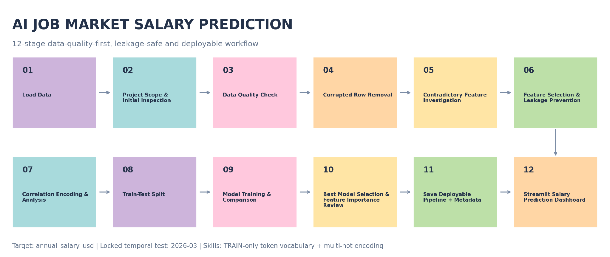

| Leakage control  Although Stage 8 is the formal split stage in the 12-stage academic presentation, the locked-period mask is declared before any target-aware diagnostics. All learned transforms and the 93-token skill vocabulary are fit on development/TRAIN data only. |
| --- |

## **STAGE 1. Load Data**
**1.1. To load raw AI Job Market Dataset:**

| Property | Observed value |
| --- | --- |
| File | ai_jobs_market_2025_2026.csv |
| Rows x columns | 1,500 x 25 |
| File size | 378,914 bytes |
| Period | Jan 2025 to Mar 2026 |

**1.2. Exploratory Data Analysis (EDA) and understand a real-world-style AI job market dataset:**

<u>Data Profiling:</u>

| # | Raw column | Canonical column | Logical type | Observed domain / range | Data rule | ML role |
| --- | --- | --- | --- | --- | --- | --- |
| 1 | job_id | job_id | String / ID | 1,500 unique; dạng AIJOB0001… | NOT NULL, UNIQUE, regex ^AIJOB\d{4}$ | BLOCK, unique posting identifier |
| 2 | job_title | job_title | Nominal categorical | 25 categories | NOT NULL; unknown category được flag | KEEP |
| 3 | AI Engineering | job_category | Nominal categorical | 13 raw values; 12 valid + 1 corrupted | "job_category" là invalid value → loại row / quarantine | KEEP after cleaning |
| 4 | experience_level | experience_level | Ordinal categorical | Entry / Mid / Senior / Lead | NOT NULL; semantic audit với years | ABLATION |
| 5 | years_of_experience | years_of_experience | Integer numeric | 1–15 | integer ≥ 0; semantic consistency check | ABLATION |
| 6 | education_required | education_required | Ordinal categorical | 5 levels | explicit ordered categories | KEEP |
| 7 | annual_salary_usd | annual_salary_usd | Integer numeric | 90,000–384,000 | > 0; NOT NULL | TARGET |
| 8 | salary_min_usd | salary_min_usd | Integer numeric | 90,000–180,000 | > 0; min ≤ max | BLOCK — target adjacent |
| 9 | salary_max_usd | salary_max_usd | Integer numeric | 180,000–320,000 | > 0; max ≥ min | BLOCK — target adjacent |
| 10 | city | city | Nominal categorical | 20 cities | NOT NULL; unknown → OOD flag | KEEP / ABLATE |
| 11 | country | country | Nominal categorical | 14 countries | NOT NULL; validate city-country pair | KEEP / ABLATE |
| 12 | remote_work | remote_work | Nominal categorical | On-site, Hybrid, Fully Remote | closed categorical domain | KEEP |
| 13 | company_size | company_size | Ordinal/nominal categorical | 5 categories | controlled vocabulary | KEEP |
| 14 | industry | industry | Nominal categorical | 12 industries | controlled vocabulary | KEEP |
| 15 | required_skills | required_skills | Multi-label text | 1,500 unique strings; | delimited | tokenize only after split; train-only vocabulary thêm một cột đánh số lượng skill_count | PHASE 2 |
| 16 | ai_salary_premium_pct | ai_salary_premium_pct | Float numeric | 3.0–18.0 | provenance/availability check | CONDITIONAL |
| 17 | demand_score | demand_score | Integer numeric | 68–98 | numeric range validation | KEEP / ABLATE |
| 18 | demand_growth_yoy_pct | demand_growth_yoy_pct | Float numeric | 5.0–87.8 | provenance/availability check | CONDITIONAL |
| 19 | benefits_score_10 | benefits_score_10 | Integer numeric | 6–10 | integer, recommended domain 0–10 | KEEP |
| 20 | posting_year | posting_year | Integer / temporal | 2025–2026 | required for temporal split | SPLIT / CONDITIONAL X |
| 21 | posting_month | posting_month | Integer / temporal | 1–12 | integer ∈ [1,12] | SPLIT / CONDITIONAL X |
| 22 | is_senior | is_senior | Boolean / binary | 0,1 | exact derived flag | BLOCK |
| 23 | is_remote_friendly | is_remote_friendly | Boolean / binary | 0,1 | exact derived flag | BLOCK |
| 24 | is_llm_role | is_llm_role | Boolean / binary | 0,1 | exact derived flag by role family | BLOCK |
| 25 | salary_tier | salary_tier | Ordinal categorical | 5 tiers | salary-derived semantic audit | BLOCK — target leakage |

## **STAGE 2. Project Scope & Initial Inspection**
- Scope: question & expectation: This project focuses on AI Job Market Data Cleaning, Exploratory Data Analysis, and Salary Prediction Modelling, demonstrating a careful, skeptical approach to validating a dataset before trusting it for machine learning - AI Job Market Salary Prediction.
- Understand dataset dimensions, dataset preview and shape inspection (df.head(), df.info()) and shape, dtypes
- descriptive statistical summaries (df.describe())
- profiling/ dictionary, describe
- data schema & rule
- Formal Task Definition

| Component | Definition |
| --- | --- |
| Task type | Supervised regression (using unsupervised regression?) |
| Modeling unit | One job posting / one CSV row after data-quality gates |
| Target y | annual_salary_usd, integer USD/year |
| Input X | Only features known at prediction time and admitted by feature policy |
| Prediction moment | Before annual_salary_usd is known/finalized |
| Primary output | Predicted annual salary in USD |
| Recommended secondary output | Empirical prediction interval + OOD/review flag + top model drivers |
| Primary intended user | Analyst / student / decision-support user exploring salary benchmarks |

- Target Distribution:
annual_salary_usd ranges from $90,000 to $384,000;
mean = $194,892;
median = $180,000;
standard deviation = $66,507.
The IQR rule flags 8 high-end values above $373,500; these are not automatically removed because salary extremes can be legitimate. Outlier handling must be evidence-based and fit on TRAIN only.
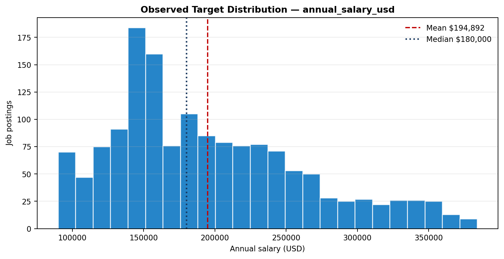
*Figure 1. salary target distribution from the raw CSV.*

## **STAGE 3. Data Quality Check**
- detect nulls and duplicate records
- sanity-check every categorical column's actual values: A full value_by_value sanity check of every categorical column — not just null/duplicate counts — was run, since those two checks alone miss corrupted values sitting inside otherwise valid-looking columns
## **STAGE 4. Corrupted Row Removal**
- The AI Engineering column contained a value of "job_category" (count = 1, job_id AIJOB1205) — the column header itself had leaked into the data as a row value. This is exactly the kind of corruption that .isnull() and .duplicated() cannot catch, and it would have silently distorted any encoding or correlation work downstream.
- Since this affected only 1 row out of 1,500, the row was dropped outright rather than guessed or imputed, reducing the dataset from 1,500 to 1,499 rows.

| Issue | Observed evidence | Magnitude | Required action |
| --- | --- | --- | --- |
| Categorical corruption | AI Engineering contains literal value "job_category" for AIJOB1205. | 1 / 1,500 | Remove row; do not impute an invented domain. |

- Zero duplicate rows were found.

## **STAGE 5. Contradictory-Feature Investigation **(Điều tra đặc trưng mâu thuẫn)
- To investigate contradictory features tell a consistent story  before trusting either of them.

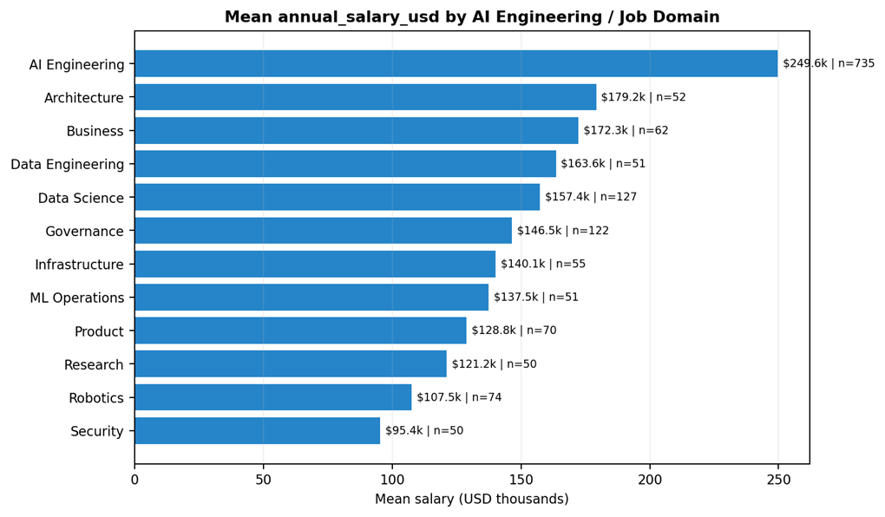
*Figure 2a. mean salary by source job-domain field; the dominant domain-level separation is a synthetic-risk signal, not causal proof.*

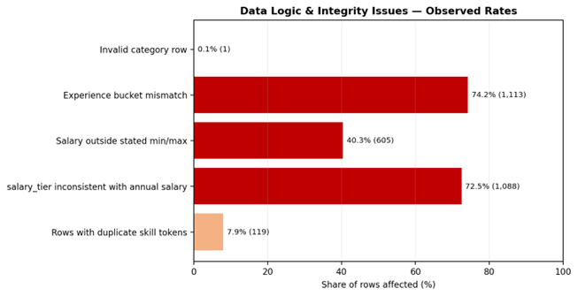
*Figure 2b. share of rows affected by selected logic/integrity findings.*

- **Critical scientific interpretation.  **The dataset can support an academic exercise in supervised regression and ML systems design. It does not, by itself, support a claim that the learned relationships are faithful real-world salary economics. Strong feature importance must therefore be presented as dataset-fit behavior and tested with ablations - experience_level & years_of_experience vs target annual_salary_usd.

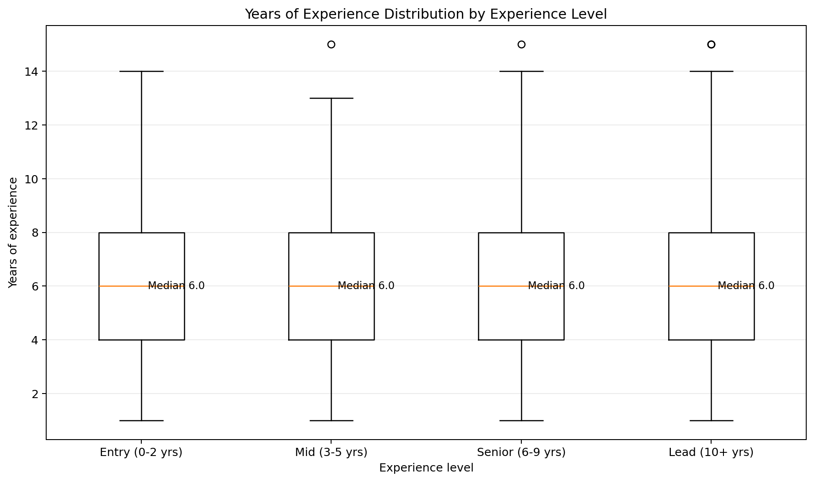
*Figure 2c. year of experience distribution by experience level.*

<u>Mean Salary by experience_level (categorical bucket)</u>
Entry (0–2 yrs): ≈ $194,837
Mid (3–5 yrs): ≈ $196,091
Senior (6–9 yrs): ≈ $195,826
Lead (10+ yrs): ≈ $193,037
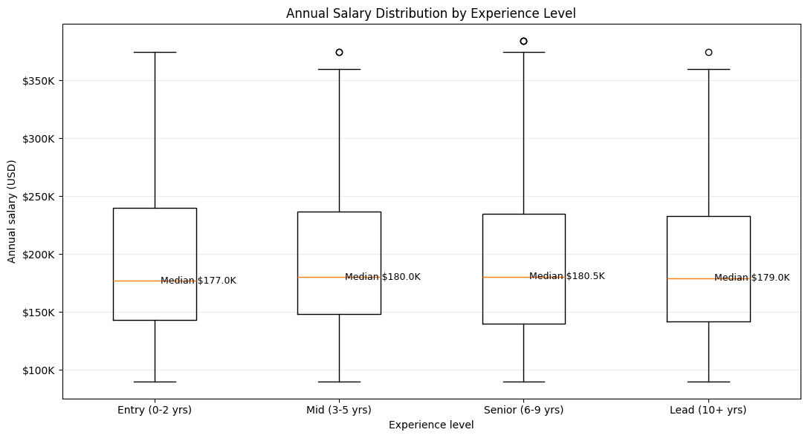
*Figure 3. annual salary distribution by experience level.*

<u>Mean Salary by years_of_experience (raw numeric, selected values)</u>
1 year: ≈ $325,800
5 years: ≈ $214,152
10 years: ≈ $132,020
15 years: ≈ $90,000
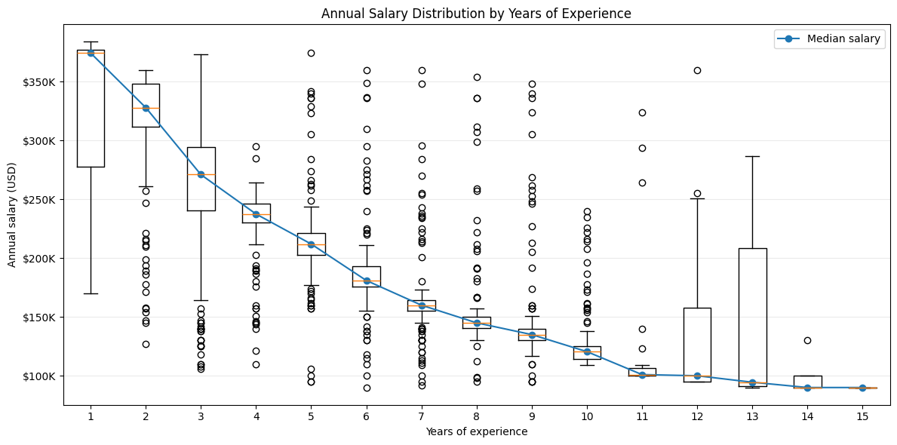
*Figure 4a. annual salary distribution by years of experience.*

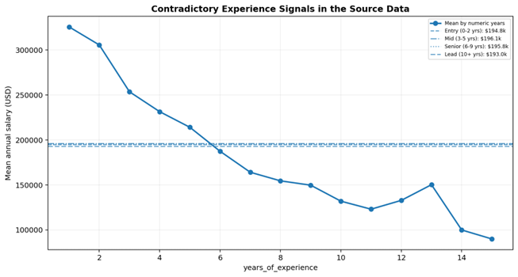
*Figure 4b. years_of_experience shows a strong downward salary pattern while experience_level means are nearly flat.*

**Finding: **experience_level shows salaries essentially flat across all four buckets (~$193k–$196k), while years_of_experience shows a strong downward trend. These two columns directly contradict each other and cannot both be reliable real-world signals.

**Ablation study:** Decision logic of Stage 5
years_of_experience
│
├─ Strong CV predictive value
├─ Strong OOT predictive value
├─ Granular numeric information
└─ KEEP WITH DOMAIN-VALIDATION FLAG
│
▼
annual_salary_usd
experience_level
│
├─ No standalone predictive value
├─ 74.2% logical inconsistency
├─ Redundant when logically consistent
├─ Apparent RF lift comes from contradiction
└─ DROP / QUARANTINE
**Decision: **this was treated as a data quality issue (most likely a synthetic-data generation artifact) rather than something to encode around silently. years_of_experience was kept as the more granular feature, experience_level was dropped as redundant and contradictory, and this relationship was flagged for cautious interpretation rather than trusted as a genuine pay-for-experience signal in any later write-up.

| Issue | Observed evidence | Magnitude | Required action |
| --- | --- | --- | --- |
| Experience semantic mismatch | experience_level bucket disagrees with years_of_experience bucket. | 1,113 / 1,499 (74.2%) | Quarantine both as a contradictory feature family; run ablation and require provenance before semantic interpretation. |

## **STAGE 6. Feature Selection & Leakage Preventaion**
(drop leakage & unused columns)
**6.1. Study feature correlation with the target variable:**
A sorted bar chart of the top 25 features by absolute correlation with annual_salary_usd was plotted (a full heatmap becomes unreadable once job_title/city/etc. are one-hot encoded into 90+ columns).

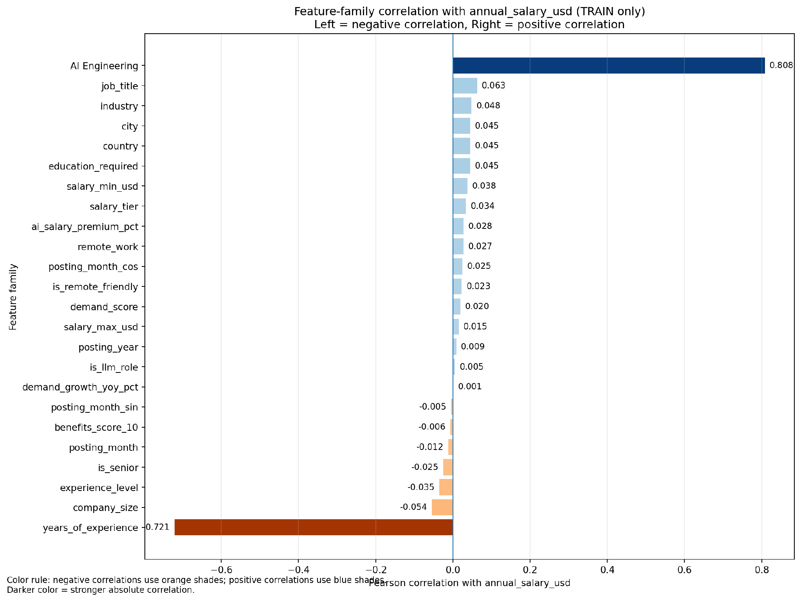
*Figure 5. feature-family correlation on Train.*

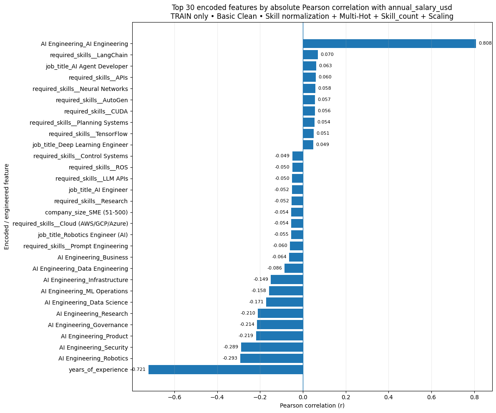
*Figure 6. top 30 features by Pearson correlation on Train.*

*Figure 7. top 30 features by Pearson correlation on Train dataset.*

**Key Correlation Findings**
Strongest positive: job_category (old name = AI Engineering) ≈ +0.808 — belonging to this domain is associated with substantially higher pay.
Strongest negative: years_of_experience ≈ −0.721 — consistent with the contradictory/synthetic-looking pattern flagged in stage 5.
Other negative signals: AI Engineering_Robotics ≈ −0.293, AI Engineering_Security ≈ −0.289, AI Engineering_Product ≈ −0.219, AI Engineering_Governance ≈ −0.214
Because one-hot dummy columns are binary indicators, their correlation with salary is directly interpretable — it reflects whether belonging to that specific category is associated with higher or lower pay, unlike a single arbitrary LabelEncoder scale that would mix categories along one meaningless numeric axis.

**6.2. Correlation analysis against the target variable: Columns that either leak the target or add no modelling value were removed:**
job_id — identifier, not a feature

| Issue | Observed evidence | Magnitude | Required action |
| --- | --- | --- | --- |
| Feature functional dependency | job_title -> salary_min_usd, salary_max_usd and demand_score exactly (one value per title). | 25/25 titles | Avoid double-counting redundant features; use ablations. |

experience_level — redundant with, and contradicts, years_of_experience (see **STAGE 5**)
salary_min_usd, salary_max_usd — leak the target (derived from the same salary structure)
salary_tier — leaks the target (a binned version of it)

| Issue | Observed evidence | Magnitude | Required action |
| --- | --- | --- | --- |
| Salary range inconsistency | annual_salary_usd is below salary_min_usd or above salary_max_usd. | 605 / 1,500 (40.3%) | Treat min/max as target-adjacent metadata, not trusted constraints. |
| Salary tier inconsistency | salary_tier does not match annual_salary_usd band by label definitions. | 1,088 / 1,500 (72.5%) | Block from primary X and do not use as target derivative. |

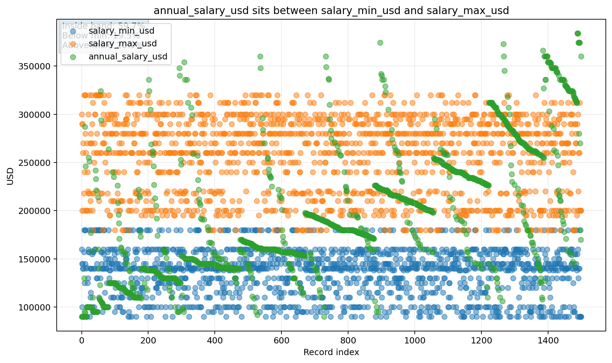
*Figure 8a. salary range inconsistency.*

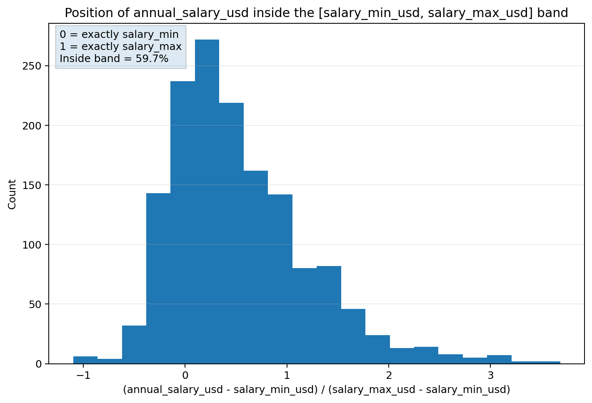
*Figure 8b. salary range inconsistency ~40.3%.*

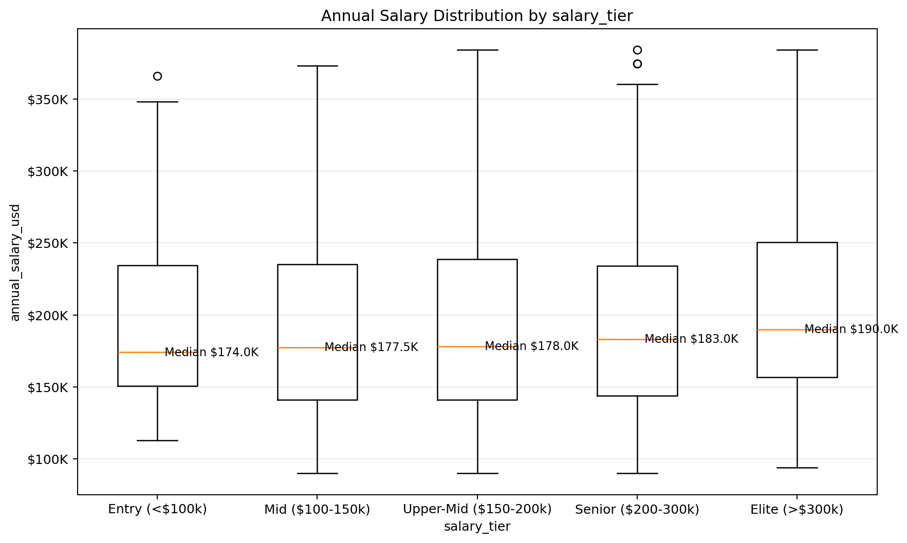
*Figure 9. salary tier inconsistency.*

required_skills — free text, would need separate NLP treatment

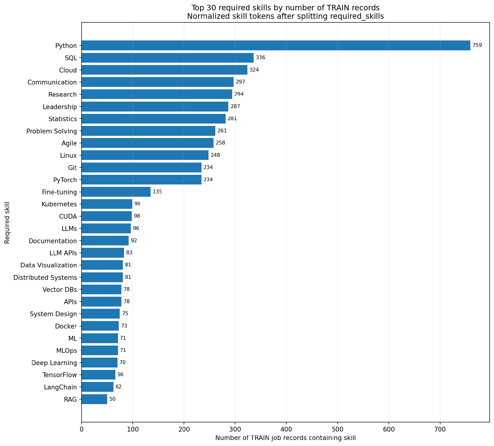
*Figure 10. top 30 required skills on Train dataset.*

posting_year, posting_month, is_senior, is_remote_friendly, is_llm_role, ai_salary_premium_pct, demand_growth_yoy_pct — not used as modelling inputs
Redundant :

| Issue | Observed evidence | Magnitude | Required action |
| --- | --- | --- | --- |
| Derived redundancy | is_senior exactly follows experience_level; is_remote_friendly exactly follows remote_work; is_llm_role is deterministic by job_title. | 0 mismatches for first two | Remove duplicate flags from the primary feature set. |
| Location redundancy | Each city maps to exactly one country in the current snapshot. | 20 cities -> 20 city-country pairs | Compare city-only, country-only and both; prefer stable generalization. |

**The final modelling feature set (11 columns): **job_title, job_category (old name = AI Engineering), years_of_experience, education_required, city, country, remote_work, company_size, industry, demand_score, benefits_score_10 — with annual_salary_usd as the target.

| # | Canonical column | Logical type | Observed domain / range | Data rule | ML role |
| --- | --- | --- | --- | --- | --- |
| 0 | job_title | Nominal categorical | 25 categories | NOT NULL; unknown category được flag | KEEP |
| 1 | job_category | Nominal categorical | 13 raw values; 12 valid + 1 corrupted | "job_category" là invalid value → loại row / quarantine | KEEP after cleaning |
| 2 | years_of_experience | Integer numeric | 1–15 | integer ≥ 0; semantic consistency check | ABLATION |
| 3 | education_required | Ordinal categorical | 5 levels | explicit ordered categories | KEEP |
| Target | annual_salary_usd | Integer numeric | 90,000–384,000 | > 0; NOT NULL | TARGET |
| 4 | city | Nominal categorical | 20 cities | NOT NULL; unknown → OOD flag | KEEP / ABLATE |
| 5 | country | Nominal categorical | 14 countries | NOT NULL; validate city-country pair | KEEP / ABLATE |
| 6 | remote_work | Nominal categorical | On-site, Hybrid, Fully Remote | closed categorical domain | KEEP |
| 7 | company_size | Ordinal/nominal categorical | 5 categories | controlled vocabulary | KEEP |
| 8 | industry | Nominal categorical | 12 industries | controlled vocabulary | KEEP |
| P2 (*) | required_skills | Multi-label text | 1,500 unique strings; | delimited | tokenize (need separate NLP treatment) only after split; train-only vocabulary thêm một cột đánh số lượng skill_count | PHASE 2 |
| 9 | demand_score | Integer numeric | 68–98 | numeric range validation | KEEP / ABLATE |
| 10 | benefits_score_10 | Integer numeric | 6–10 | integer, recommended domain 0–10 | KEEP |
| Split | posting_year | Integer / temporal | 2025–2026 | required for temporal split | SPLIT / CONDITIONAL X |
| Split | posting_month | Integer / temporal | 1–12 | integer ∈ [1,12] | SPLIT / CONDITIONAL X |

**6.3. Target leakage investigation** (Điều tra rò rỉ mục tiêu)
- Feature Availability and Leakage Policy: A predictor is eligible only if it is (a) semantically meaningful for the use case, (b) available at inference time, (c) not derived from the target or a post-target process, (d) not an identifier/proxy memorizer, and (e) stable enough to generalize across the temporal holdout. Correlation alone does not prove or disprove leakage; provenance and generation logic are required.

| Policy | Features | Reason |
| --- | --- | --- |
| BLOCK | job_id; salary_min_usd; salary_max_usd; salary_tier; is_senior; is_remote_friendly; is_llm_role | Identifiers, target-adjacent compensation fields, or deterministic redundant flags. |
| CONTRADICTORY ablation | years_of_experience; experience_level | Do not silently choose one as truth; compare feature families and document sensitivity. |
| CONDITIONAL | ai_salary_premium_pct; demand_growth_yoy_pct; posting_year; posting_month | Use only after availability/provenance and temporal-proxy checks. |

**- **Required Feature-Family Ablation Experiments:

| Experiment | Feature set | Decision question |
| --- | --- | --- |
| A0 - Conservative | Core categorical + education + benefits; no experience; no target-adjacent fields. | Reference for plausibility. |
| A1 - + years | A0 + years_of_experience | Measure predictive gain from the suspicious numeric experience signal. |
| A2 - + experience bucket | A0 + experience_level, excluding numeric years | Compare the alternate experience representation. |
| A3 - Geography | Country-only vs city-only vs both | Check redundancy and unseen-location risk. |
| A4 - Demand | With vs without demand_score | Because demand_score is exactly determined by job_title. |
| A5 - Time | With vs without posting year/month | Detect temporal proxy dependence. |
| A6 - Skills (Phase 2) | Tokenized skills added to the selected structured feature set | Measure incremental signal without raw-string memorization. |
