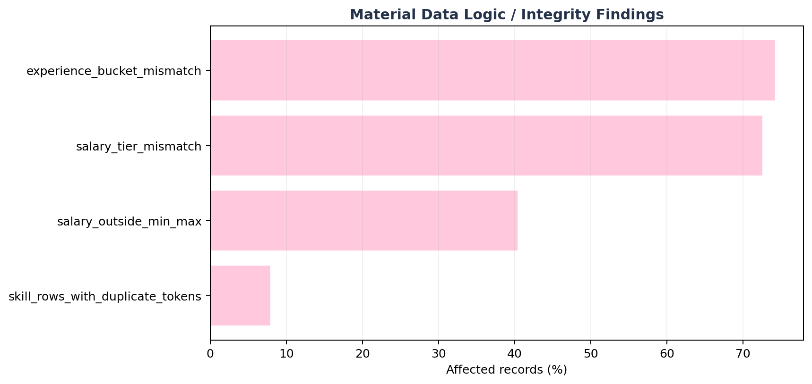
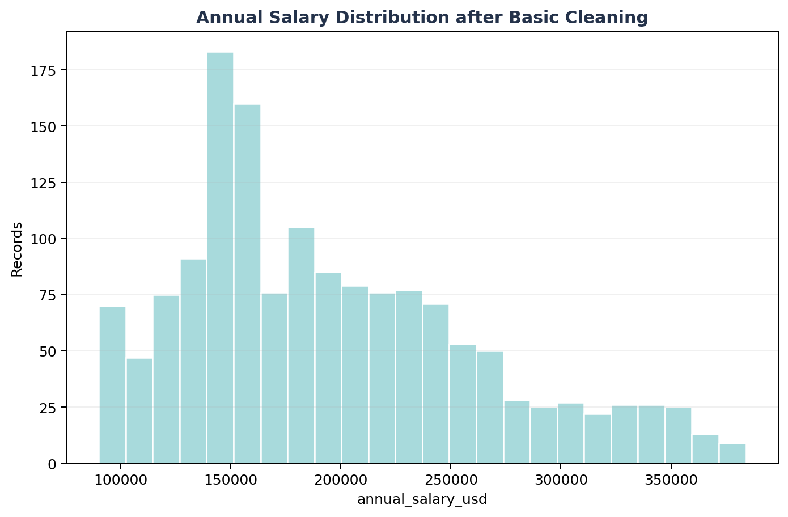
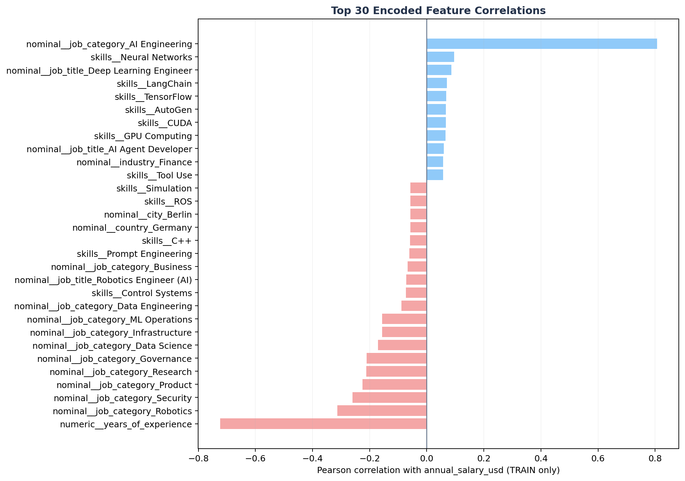
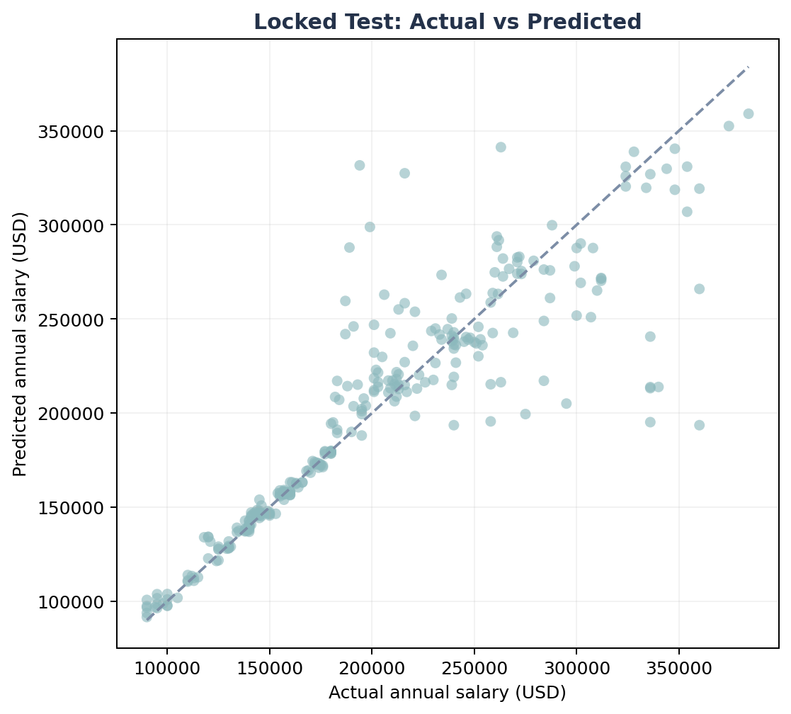
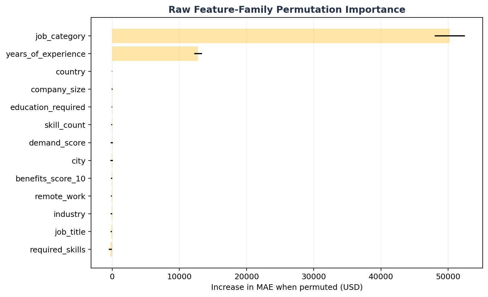
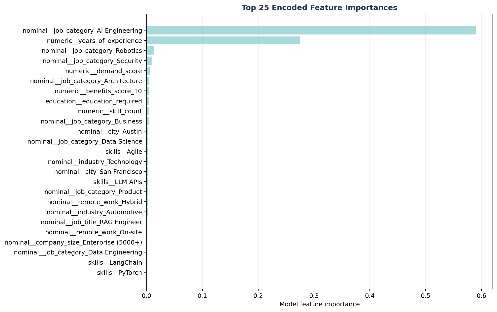

*Part 4 of 5*
## **D.2. app.py File — Streamlit Salary Predictor**
Unlike a multi-file backend, this project keeps everything — artifact loading, prediction logic, and the UI — inside a single app.py script. Below is a walkthrough of what each part does, followed by the full code.
**2.1 Imports, Paths & Page Setup**
The script imports joblib and pandas for loading the trained pipeline and building input rows, and streamlit for the UI. ARTIFACTS_DIR is computed relative to app.py's own file location (Path(__file__).parent / "artifacts"), so the artifacts/ folder must sit next to app.py. st.set_page_config() sets the browser tab title, a 💰 icon, a wide layout, and a collapsed sidebar, since this app doesn't use one.
**2.2 Custom Styling**
A block of custom CSS is injected via st.markdown(..., unsafe_allow_html=True) to move away from Streamlit's default look: a centered, bold blue title, a muted subtitle, a rounded bordered box around the input form, and a blue-to-purple gradient card used later to display the predicted salary.
**2.3 Loading the Model (Cached)**
The load() function is decorated with **@st.cache_resource**, so the preprocessor, model, feature column list, and metadata are only loaded from disk once per server session, not on every user interaction or form submission. _require() checks each artifact file exists first and calls st.stop() with a clear error message if anything is missing, rather than crashing with a raw file-not-found traceback.
**2.4 The predict() Function**
This is the entire inference step: it wraps the incoming inputs dictionary in a single-row DataFrame, reindexes its columns to match cols (the exact feature_columns.json order the model was trained on — filling in any structurally missing column as NaN rather than erroring), passes that row through the fitted preprocessor (pre.transform), and returns the model's single prediction as a plain float.
**2.5 Reading Metadata for the Form**
Right after loading, the script pulls three things out of metadata.json: cats (valid category options per column), ranges (min/max for numeric columns), and education_order (the ordinal ranking for education_required). These drive every dropdown and slider below, so the form can never offer a value the model wasn't trained on.
**2.6 Header & Live Model Metrics**
The page title and subtitle are rendered, followed by a 3-column metric row showing metadata["best_model_name"], the test R² score (to 3 decimals), and the test MAE (formatted as a dollar amount) — so the model's own reported accuracy is visible to the user directly above the prediction form, not hidden away.
**2.7 The Prediction Form**
All inputs are grouped inside a single st.form("prediction"), which means Streamlit won't re-run the whole script on every individual widget change — only when the form is submitted. Inputs are split into two columns:
Left column: Job Title, AI Engineering (domain), Years of Experience (slider bounded by the trained min/max), Education (ordered dropdown), Country
Right column: Remote Work, Company Size, Industry, Demand Score (slider), Benefits Score (slider)
Note that city is not collected from the user — the file comment ("Country only UI") and the DEFAULT_CITY = "Unknown" constant show this was a deliberate simplification, sending a fixed placeholder city value to the model instead of asking the user to pick one.
**2.8 Handling Submission & Displaying the Result**
When "🚀 Predict Salary" is clicked, the script assembles an inputs dictionary using the exact column names the model expects (job_title, "AI Engineering", years_of_experience, education_required, city, country, remote_work, company_size, industry, demand_score, benefits_score_10), calls predict() inside a spinner, and renders the result inside the gradient "prediction" card defined in the CSS — showing the estimated annual salary formatted with thousands separators and the winning model's name underneath. A small table below echoes back every value the user submitted, as a transparency check.
**2.9 Full Code**

"""
AI Job Market Salary Predictor
Complete Streamlit App (Country only UI)
"""

import json
from pathlib import Path

import joblib
import pandas as pd
import streamlit as st

ARTIFACTS_DIR = Path(__file__).parent / "artifacts"
PREPROCESSOR_PATH = ARTIFACTS_DIR / "preprocessor.pkl"
MODEL_PATH = ARTIFACTS_DIR / "model.pkl"
FEATURE_COLUMNS_PATH = ARTIFACTS_DIR / "feature_columns.json"
METADATA_PATH = ARTIFACTS_DIR / "metadata.json"

DEFAULT_CITY = "Unknown"   # Change if your model expects a specific city.

st.set_page_config(
page_title="AI Job Salary Predictor",
page_icon="💰",
layout="wide",
initial_sidebar_state="collapsed",
)

st.markdown("""

""", unsafe_allow_html=True)

def _require(path):
if not path.exists():
st.error(f"Missing artifact: {path}")
st.stop()

@st.cache_resource
def load():
for p in [PREPROCESSOR_PATH, MODEL_PATH, FEATURE_COLUMNS_PATH, METADATA_PATH]:
_require(p)
pre = joblib.load(PREPROCESSOR_PATH)
model = joblib.load(MODEL_PATH)
cols = json.loads(FEATURE_COLUMNS_PATH.read_text())
meta = json.loads(METADATA_PATH.read_text())
return pre, model, cols, meta

def predict(pre, model, cols, inputs):
row = pd.DataFrame([inputs])
row = row.reindex(columns=cols)
x = pre.transform(row)
return float(model.predict(x)[0])

pre, model, feature_columns, metadata = load()

cats = metadata["category_options"]
ranges = metadata["numeric_ranges"]
education_order = metadata["ordinal_order"]["education_required"]

st.markdown('
💰 AI Job Market Salary Predictor
', unsafe_allow_html=True)
st.markdown('
Predict AI salaries using Machine Learning
', unsafe_allow_html=True)

m1,m2,m3=st.columns(3)
m1.metric("Model",metadata["best_model_name"])
m2.metric("Test R²",f'{metadata["test_r2"]:.3f}')
m3.metric("MAE",f'${metadata["test_mae"]:,.0f}')

with st.form("prediction"):
c1,c2=st.columns(2)
with c1:
job_title=st.selectbox("Job Title",cats["job_title"])
ai=st.selectbox("AI Engineering",cats["AI Engineering"])
exp=st.slider("Years of Experience",
ranges["years_of_experience"]["min"],
ranges["years_of_experience"]["max"],5)
edu=st.selectbox("Education",education_order)
country=st.selectbox("Country",cats["country"])
with c2:
remote=st.selectbox("Remote Work",cats["remote_work"])
company=st.selectbox("Company Size",cats["company_size"])
industry=st.selectbox("Industry",cats["industry"])
demand=st.slider("Demand Score",
ranges["demand_score"]["min"],
ranges["demand_score"]["max"],
(ranges["demand_score"]["min"]+ranges["demand_score"]["max"])//2)
benefits=st.slider("Benefits Score",
ranges["benefits_score_10"]["min"],
ranges["benefits_score_10"]["max"],
(ranges["benefits_score_10"]["min"]+ranges["benefits_score_10"]["max"])//2)

submit=st.form_submit_button("🚀 Predict Salary",use_container_width=True)

if submit:
inputs={
"job_title":job_title,
"AI Engineering":ai,
"years_of_experience":exp,
"education_required":edu,
"city":DEFAULT_CITY,
"country":country,
"remote_work":remote,
"company_size":company,
"industry":industry,
"demand_score":demand,
"benefits_score_10":benefits,
}

with st.spinner("Predicting..."):
salary=predict(pre,model,feature_columns,inputs)

st.markdown(f"""

<h2>Estimated Annual Salary</h2>
<h1>${salary:,.0f}</h1>

{metadata["best_model_name"]}

""",unsafe_allow_html=True)

st.dataframe(pd.DataFrame(inputs.items(),columns=["Feature","Value"]),
use_container_width=True,hide_index=True)

st.markdown('
Built with Streamlit • Scikit-learn • Python
',
unsafe_allow_html=True)

# E – INSTALLATION & HOW TO RUN THE PROJECT

Project Folder Structure: Based on the file paths referenced inside the notebook and app.py, the project should be organized as follows — app.py and the notebook should sit in the same root folder, since both expect an artifacts/ folder as a direct sibling:
Ai_job_market/
├── artifacts/                            (created by the notebook: preprocessor.pkl,
│                                           model.pkl, feature_columns.json, metadata.json)
├── data/
│   └── ai_jobs_market_2025_2026.csv       (raw dataset)
├── salary_predict_corrected.ipynb         (data cleaning + EDA + model training)
└── app.py                                 (Streamlit dashboard)
All commands below should be run from inside the Ai_job_market/ root folder.

## **Step 1: Install the required libraries**
Open a terminal in the project root and run:
pip install pandas numpy matplotlib scikit-learn joblib streamlit jupyter
## **Step 2: Run the data cleaning, EDA & model-training notebook**
Update the pd.read_csv(...) path near the top of the notebook to point at data/ai_jobs_market_2025_2026.csv on your machine, then launch Jupyter:
jupyter notebook salary_predict_corrected.ipynb
Run all cells in order (Cell → Run All). This performs the data quality checks, drops the corrupted row and leakage columns, trains and compares five regression models, and finally saves the winning pipeline and metadata into an artifacts/ folder — the "Save the Best Model as a Deployable Artifact" step at the end of the notebook.
## **Step 3: Launch the Streamlit dashboard**
Once artifacts/ has been created by the notebook, start the dashboard from the project root:
streamlit run app.py
This opens the AI Job Market Salary Predictor in your browser at http://localhost:8501, where you can fill in the job/role form and click "🚀 Predict Salary" to get an instant estimate, model name, and accuracy metrics (see the Streamlit Dashboard section below).

# F - CONCLUSION AND FUTURE DEVELOPMENT

| F.1 | Data Basic Clean A null-free dataset was not accepted at face value; logic and categorical corruption were audited. |
| --- | --- |

| 1500 Raw rows | 25 Raw columns | 0 Missing cells | 0 Duplicates |
| --- | --- | --- | --- |

Basic structural checks found 0 missing cells and 0 duplicate rows. However, the categorical sanity check identified one corrupted row in the source field 'AI Engineering': the literal header value 'job_category' appeared as a record value. That row was removed and the field was canonically renamed to job_category, producing 1,499 clean records.

*Figure 1. Share of clean rows affected by major logic/integrity findings.*

| issue | affected_rows | affected_pct | action |
| --- | --- | --- | --- |
| experience_bucket_mismatch | 1113 | 74.2% | Drop experience_level from primary model; retain years_of_experience as an ablation-sensitive numeric feature. |
| salary_outside_min_max | 605 | 40.4% | Block salary_min_usd and salary_max_usd from X. |
| salary_tier_mismatch | 1,087 | 72.5% | Block salary_tier from X. |
| skill_rows_with_duplicate_tokens | 118 | 7.9% | De-duplicate skill tokens within each row before multi-hot encoding. |

| Conclusion – Data basic clean  Structural cleanliness alone would have been misleading. The cleaned output is suitable for controlled modeling only after blocking inconsistent target-adjacent fields and explicitly treating experience semantics as a synthetic-risk warning. |
| --- |

*Figure 2. Target distribution after basic cleaning.*

| F.2 | Data Ready for Machine Learning Leakage gate, temporal split, TRAIN-only encoding/scaling, multi-hot skills and skill_count. |
| --- | --- |

| 1,201 TRAIN / DEV | 298 Locked Test | 93 Skill vocabulary | 189 Encoded features |
| --- | --- | --- | --- |

The model input retains the technical design's 11 structured predictors and adds a skill-aware Phase-2 enhancement: required_skills is normalized into distinct pipe-separated tokens, multi-hot encoded by a vocabulary learned only from TRAIN/DEV, and accompanied by skill_count (distinct token count). In this supplied snapshot the TRAIN vocabulary contains 93 tokens.
**Allowed model inputs:**

| feature | role |
| --- | --- |
| job_title | KEEP |
| job_category | KEEP |
| years_of_experience | KEEP |
| education_required | KEEP |
| city | KEEP |
| country | KEEP |
| remote_work | KEEP |
| company_size | KEEP |
| industry | KEEP |
| demand_score | KEEP |
| benefits_score_10 | KEEP |
| required_skills | PHASE2_MULTI_HOT |
| skill_count | ENGINEERED |

Blocked fields include identifiers, target-adjacent salary metadata, contradictory/redundant experience flags, and non-serving metadata. This protects the model from learning the answer directly or from unstable derived signals.

| feature | reason |
| --- | --- |
| job_id | Identifier, redundant/contradictory, derived flag, or non-serving metadata |
| salary_min_usd | Target leakage / target-adjacent |
| salary_max_usd | Target leakage / target-adjacent |
| salary_tier | Target leakage / target-adjacent |
| experience_level | Identifier, redundant/contradictory, derived flag, or non-serving metadata |
| posting_year | Identifier, redundant/contradictory, derived flag, or non-serving metadata |
| posting_month | Identifier, redundant/contradictory, derived flag, or non-serving metadata |
| is_senior | Identifier, redundant/contradictory, derived flag, or non-serving metadata |
| is_remote_friendly | Identifier, redundant/contradictory, derived flag, or non-serving metadata |
| is_llm_role | Identifier, redundant/contradictory, derived flag, or non-serving metadata |
| ai_salary_premium_pct | Identifier, redundant/contradictory, derived flag, or non-serving metadata |
| demand_growth_yoy_pct | Identifier, redundant/contradictory, derived flag, or non-serving metadata |

*Figure 3. Top 30 TRAIN-only encoded correlations with annual_salary_usd.*

| Conclusion – Data ready for ML  The encoded dataset is ready for modeling with 189 numeric columns. The strongest TRAIN-only encoded correlation is nominal__job_category_AI Engineering (r=+0.807); this is diagnostic association, not causal evidence. |
| --- |

| F.3 | Model Comparison Five regression families evaluated on the same expanding monthly temporal-validation folds. |
| --- | --- |

*Figure 4. Temporal CV MAE across five candidate regression models.*

*Figure 5. Mean temporal CV R² by model family.*

| Conclusion – Model Comparison  Select Random Forest using development-period evidence. The locked March-2026 test remains outside candidate comparison and is opened only after this selection/tuning decision is frozen. |
| --- |

| F.4 | Best Model Selection & Importance Feature Review Final one-time locked-test evaluation plus model-behavior diagnostics. |
| --- | --- |

| Random Forest Best model | $14,961 MAE | $29,844 RMSE | 0.803 R² | $4,467 MedAE |
| --- | --- | --- | --- | --- |

*Figure 6. Locked test: actual versus predicted annual salary.*

*Figure 7. Raw feature-family permutation importance measured on final test.*

| raw_feature | importance_mean | importance_std |
| --- | --- | --- |
| job_category | $50,242 | $2,246 |
| years_of_experience | $12,796 | $600 |
| country | $5 | $22 |
| company_size | $-27 | $60 |
| education_required | $-41 | $63 |
| skill_count | $-48 | $72 |
| demand_score | $-56 | $176 |
| city | $-65 | $187 |

*Figure 8. Top encoded feature importances inside the selected estimator.*

| encoded_feature | importance |
| --- | --- |
| nominal__job_category_AI Engineering | 0.5908 |
| numeric__years_of_experience | 0.2753 |
| nominal__job_category_Robotics | 0.0136 |
| nominal__job_category_Security | 0.0091 |
| numeric__demand_score | 0.0054 |
| nominal__job_category_Architecture | 0.0050 |
| numeric__benefits_score_10 | 0.0044 |
| education__education_required | 0.0042 |
| numeric__skill_count | 0.0041 |
| nominal__job_category_Business | 0.0041 |

| Conclusion – Best model & importance  The final locked-test R² is 0.803. Permutation evidence is dominated by job_category and years_of_experience. Because these are embedded in a dataset with contradictory and synthetic-looking structure, their importance must be reported as model reliance rather than causal salary drivers. |
| --- |
| F.5 | AI Market Job Salary Prediction Deployable bundle, authenticated Streamlit interface and practical prediction interval. |

| 298 Locked test rows | $197,787 Mean prediction | $194,694 Median prediction | $32,216 90% half-width |
| --- | --- | --- | --- |

The selected Random Forest pipeline is serialized as artifacts/model_bundle.joblib together with metadata.json. Streamlit reads the same feature contract, category options, numeric ranges, 93-skill vocabulary and empirical validation-error interval used by the offline model. This avoids manual encoder/model mismatch during interactive prediction.

*Figure 11. Salary prediction performance on the final locked period.*

| job_title | job_category | city | annual_salary_usd | predicted_salary_usd | absolute_error_usd |
| --- | --- | --- | --- | --- | --- |
| Data Scientist | AI Engineering | New York | $190,000 | $189,995 | $5 |
| LLM Engineer | Infrastructure | Singapore | $140,000 | $139,978 | $22 |
| Generative AI Engineer | Infrastructure | Bangalore | $140,000 | $140,025 | $25 |
| AI Research Scientist | Governance | Bangalore | $146,000 | $146,074 | $74 |
| Multimodal AI Engineer | ML Operations | San Francisco | $138,000 | $138,085 | $85 |
| Deep Learning Engineer | Architecture | Austin | $180,000 | $179,911 | $89 |
| Deep Learning Engineer | Infrastructure | Tokyo | $140,000 | $139,910 | $90 |
| NLP Engineer | Data Science | Los Angeles | $157,000 | $156,892 | $108 |

| Streamlit login  The delivered streamlit.py includes a local demo login (admin / AIJob2026!) and supports replacement via Streamlit secrets or AIJOB_APP_USER + AIJOB_APP_PASSWORD_SHA256 environment variables. The demo credential must be changed before any shared deployment. |
| --- |

| Conclusion – Salary Prediction  The final model is suitable for academic salary benchmarking and scenario exploration inside this dataset’s empirical scope. A practical interval of approximately ±$32,216 is shown to communicate uncertainty instead of presenting an unexplained point estimate only. |
| --- |
